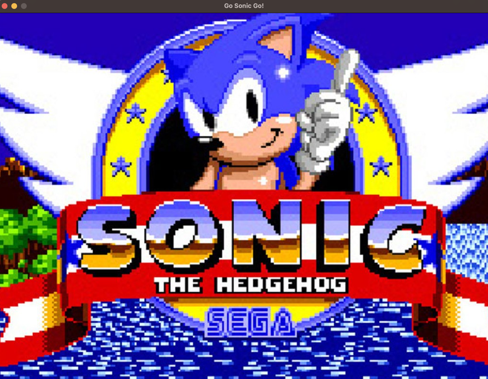
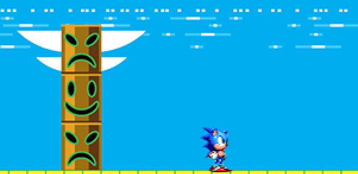
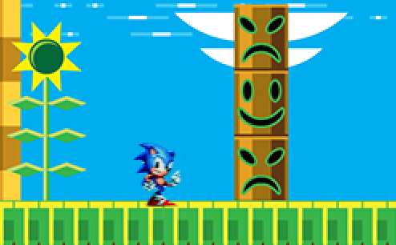
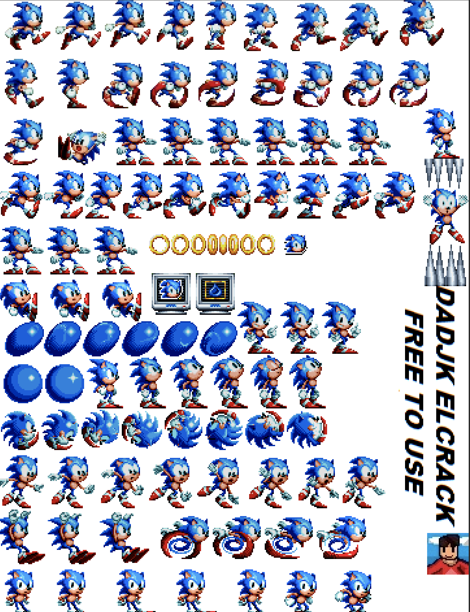

# Go Sonic Go



A Sonic engine implemented using [pixel](https://github.com/faiface/pixel) animation and [beep](https://github.com/faiface/beep) for audio in Go.

https://user-images.githubusercontent.com/2054461/211116034-de51001f-e8f9-4282-bec2-b1da2f1584d8.mov

[SonicEngine](main/SonicEngine.go) contains all the logic of animations of 

```
Run, Jump, Wait, Loop up, Look down, Spin.
```




[SonicGame](main/SonicGame.go) is the ```main``` class that create the Window, load all the [sprites](sprites/) and use 
```pixel``` lib to get all Key events to invoke the specific animation of the engine.

All the sprites have been used thanks to this author.




